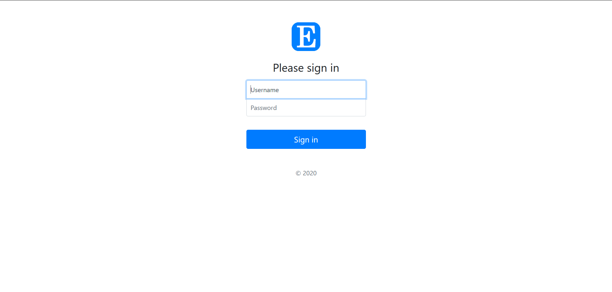
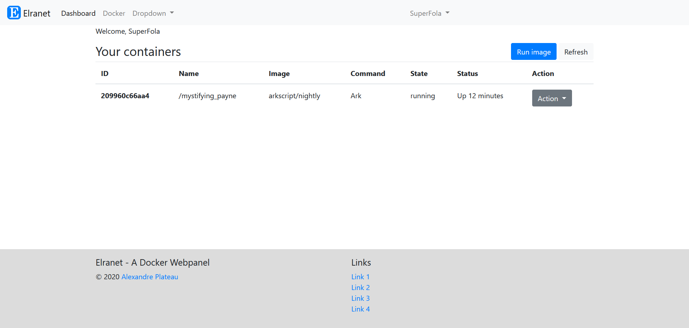
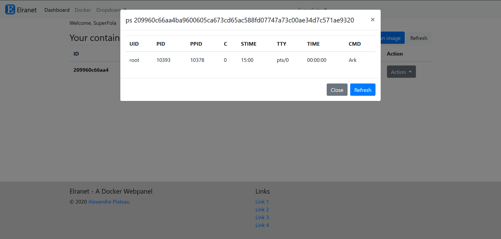
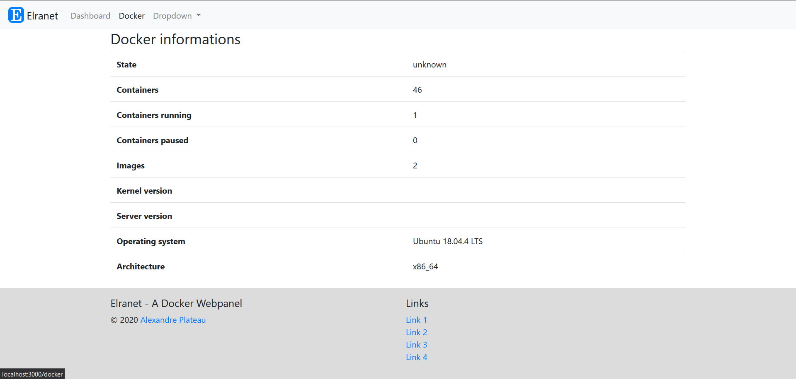

# Elranet

A simple docker webpanel, based on express and [dockerode](https://github.com/apocas/dockerode).

## Installing

You will need
* docker and its daemon
* screen (to run the daemon in background and keep it running)
* nodejs >= 12

Then run the usual `npm i`.

You will need to create a `.env` base on the provided `.env.example`. *Nota bene*: the PASS field is the sha256 of the password.

Run the interface using `node main.js`, it will start on localhost:3000.

## Contributing

* First, [fork](https://github.com/SuperFola/elranet) the repository
* Then, clone your fork: `git clone git@github.com:username/elranet.git`
* Create a branch for your feature: `git checkout -b feat-my-awesome-idea`
* When you're done, push it to your fork and submit a pull request!

Don't know what to work on? Check the [issues](https://github.com/SuperFola/elranet/issues)!

## Screenshots

